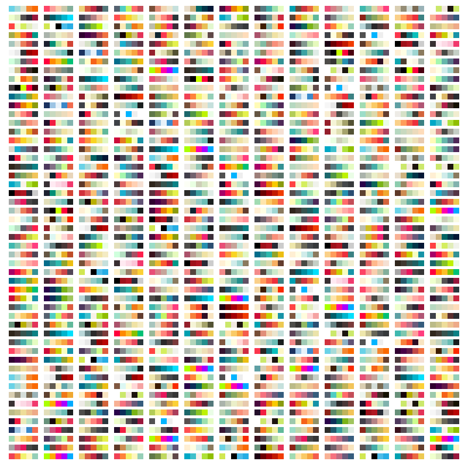

# Nice Color Palettes for Processing
A JSON of the top color palettes on [ColourLovers.com](https://www.colourlovers.com) for Processing. Inspired by [nice-color-palettes](https://github.com/Jam3/nice-color-palettes).



## How to use it
### Installation
[Download](https://github.com/federico-pepe/nice-color-palettes/releases) the library from GitHub and install it in the sketchbook folder inside the folder name *libraries*. If you have any trouble you can [read the official documentation](https://github.com/processing/processing/wiki/How-to-Install-a-Contributed-Library).

### Use the library
Once you've installed the library, open Processing and import it into your sketch:

```processing
import nice.palettes.*;
```

Then you have to declare the main **ColorPalette** object.

```processing
ColorPalette palette;
```

In the `void setup()` function initialize the object and pass a reference to the current PApplet

```processing
palette = new ColorPalette(this);
```

### Get a random color palette

Now you can call the `getPalette()` method to get an array of five different colors that work well together and are chosen randomly:

```processing
 // Import the library
import nice.palettes.*;

// Declare the main ColorPalette object
ColorPalette palette;

void setup() {
  // Initialize it, passing a reference to the current PApplet 
  palette = new ColorPalette(this);
  
  // Get a random color palette
  printArray(palette.getPalette());
}

void draw() {
}
```

### Get specific palette
You can recall a palette by passing a number to the method `getPalette`. For example: `getPalette(5)` will always return the same color palette.

```processing
 // Import the library
import nice.palettes.*;

// Declare the main ColorPalette object
ColorPalette palette;

void setup() {
  // Initialize it, passing a reference to the current PApplet 
  palette = new ColorPalette(this);
  
  // Print an array of integers of the color palette
  // Calling getPalette() with parameters will always return the same palette
  printArray(palette.getPalette(5));
}

void draw() {
}
```

### Get the numbers of palette available
You can call the function `getPaletteCount()` to have the numbers of available palettes

```processing
// Import the library
import nice.palettes.*;

// Declare the main ColorPalette object
ColorPalette palette;

void setup() {
  // Initialize it, passing a reference to the current PApplet 
  palette = new ColorPalette(this);
  
  palette.getPalette();
 
  // Calling getPaletteCount() to return the number of palettes available
  println(palette.getPaletteCount());
}

void draw() {
}
```

### Get the colors inside a palette
You can get the colors of a palette directly.

```processing
palette.colors[0];
```
Please remember that each palette array only contains **five** colors so `palette.colors[5];` will return an error. If you wan to pick a random color inside the palette you can use this code:

```processing
palette.colors[(int)random(4)]
```

You can also assign the colors to a variable:

```processing
colors[] c = palette.getPalette();
printArray(c);
```

### Download a new JSON from ColourLovers
You can download an updated version of the top palettes on ColourLovers by calling the function `refresh()`. The JSON file will be downloaded into the sketch's data folder and saved with the name **nice-color-palettes.json**.
```processing
palette.refresh();
```
By default the function `refresh()` will download 20 results. But you use a parameter if you need more results (max 100) `palette.refresh(100)`.
